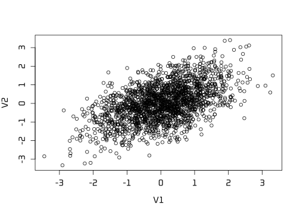
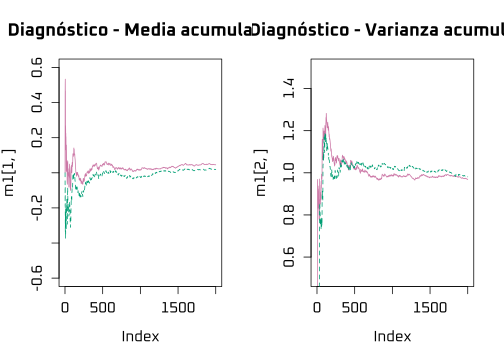
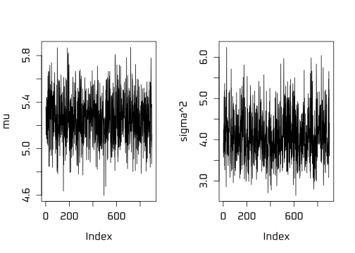
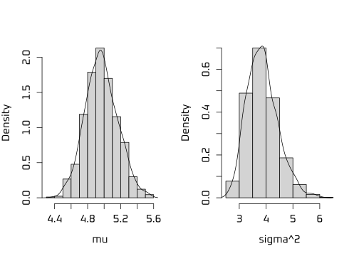
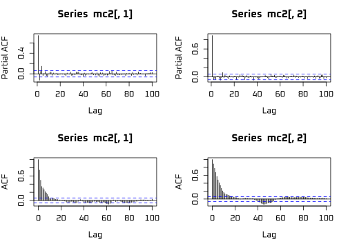

# Elementos de simulación estadística

Como lo afirma @Gelman03 la simulación numérica es parte central del análisis bayesiano puesto que la generación de datos provenientes de una distribución de probabilidad se puede realizar fácilmente, incluso cuando la forma estructural de ésta no es conocida o es muy complicada computacionalmente. A lo largo de la historia del desarrollo de la teoría estadística, la simulación de distribuciones de probabilidad ha jugado un papel importante. Aunque son innumerables los métodos de generación de datos, en este apartado, se da cuenta de unos pocos, quizás lo más usados en este auge computacional.

`R` es un software de uso libre que maneja un ambiente de programación enfocado al manejo de matrices y por lo tanto muy apropiado para realizar la simulación de las distribuciones posteriores y predictivas necesarias para la inferencia bayesiana. En este capítulo, usando una serie de ejemplos, se describe cómo
`R` puede ser usado como una herramienta efectiva. Estos ejemplos tienen un énfasis especial en tópicos bayesianos, específicamente en el uso de las cadenas de Markov para simular distribuciones posteriores.

## Métodos directos

### Método de la transformación uniforme

Al momento de la simulación estocástica de observaciones provenientes de alguna distribución de interés, la distribución uniforme es quizás la más usada y la más importante. El siguiente resultado adaptado de @Casella así lo confirma.

\BeginKnitrBlock{proposition}<div class="proposition"><span class="proposition" id="prp:unnamed-chunk-2"><strong>(\#prp:unnamed-chunk-2) </strong></span>Si $U$ es una variable aleatoria con distribución uniforme en el intervalo $(0,1)$, entonces la la variable aleatoria $F^{-1}(U)$ tiene distribución F.</div>\EndKnitrBlock{proposition}
<br>

Aunque la función $F$ no necesariamente es una función uno a uno (por lo menos no lo es en el caso discreto) sí se puede verificar que $F^{-1}(U)$ es única con probabilidad uno. Una definición general, que encaja en el caso continuo o discreto, de la función $F$ inversa es la siguiente

\BeginKnitrBlock{definition}<div class="definition"><span class="definition" id="def:unnamed-chunk-3"><strong>(\#def:unnamed-chunk-3) </strong></span>Para cualquier función $F$ definida sobre $\mathbb{R}$, se define la función inversa generalizada de $F$ como

\begin{equation}
F^{-1}(u)=\inf \{x \mid F(x)\geq u\}
\end{equation}</div>\EndKnitrBlock{definition}


\BeginKnitrBlock{example}<div class="example"><span class="example" id="exm:unnamed-chunk-4"><strong>(\#exm:unnamed-chunk-4) </strong></span>Suponga que $X$ es una variable aleatoria con distribución exponencial. De esta forma, su función de densidad acumulativa viene dada por

\begin{equation*}
F(x)=1-\exp\{ -\theta x\}
\end{equation*}

Del anterior resultado se tiene que si $u$ es una realización de una variable $U \sim Uniforme(0,1)$, entonces $F^{-1}(u)$ es una realización de una variable con distribución exponencial. Como $x=F^{-1}(u)$, entonces $F(x)=u$ y despejando $x$, se llega a que la siguiente expresión

\begin{equation*}
F^{-1}(u)=-\frac{\ln(1-u)}{\theta}
\end{equation*}

entrega una forma diáfana para la simulación de una observación con distribución exponencial. Para simular una muestra de $n$ observaciones, simplemente se repite el anterior procedimiento $n$ veces. En `R`, el código necesario para la simulación de una muestra de tamaño 1000 proveniente de una distribución exponencial con parámetro $\theta=5$ es</div>\EndKnitrBlock{example}


```r
theta <- 5
u <- runif(1000)
rexpo <- log(1 - u)/(-theta)
1/mean(rexpo)
```

```
## [1] 4.843383
```

```r
hist(rexpo, freq = FALSE)
lines(density(rexpo), col = 2)
```

<div class="figure">

<p class="caption">(\#fig:unnamed-chunk-5)Histograma de observaciones con distribución exponencial</p>
</div>

### Método de la grilla

Existen distribuciones de probabilidad cuya forma estructural es muy compleja. Mas aún, existen distribuciones de probabilidad conocidas para las cuales la inversa de la función de de densidad acumulativa es difícil de solucionar analíticamente. En los anteriores casos, el método analítico dado por el teorema de la transformación integral de probabilidad no siempre resulta efectivo. Sin embargo, es posible realizar una variante, manteniendo el espíritu de la anterior técnica.

El presente método utiliza una distribución discreta para aproximar cualquier tipo de distribución (discreta o continua) sin importar su nivel de complejidad. El algoritmo que enmarca este método se da a continuación:

1. Escribir la densidad de interés como $f(\cdot)$ y establecer el rango de la variable aleatoria de interés.
2. Fijar un conjunto de $n$ valores $x_1<\cdots<x_n$ equiespaciados que cubran una gran parte del rango de la variable aleatoria.
3. Para $x_k$ $(k=1,\ldots,n)$ calcular $f(x_k)$ que equivale al valor de la densidad en el punto $x_k$. Nótese que si $f(\cdot)$ es una función de densidad continua, entonces $f(x_k)$ no corresponde a una probabilidad;
4. Calcular la probabilidad asociada al punto $x_k$ definida por la aproximación discreta a $f(\cdot)$ y dada por
\begin{equation*}
p(x_k)=\frac{f(x_k)}{\sum_{k=1}^{n}f(x_k)}
\end{equation*}
5. Calcular la función de densidad acumulativa aproximada definida como
\begin{equation*}
F(x)=
\begin{cases}
0, \ \ \ \text{si $x<x_1$}\\
\sum_{l=1}^kp(x_l), \ \ \ \text{si $x_k\leq x<x_{k+1}$}\\
1, \ \ \ \text{si $x>x_n$}
\end{cases}
\end{equation*}
6. Simular una observación $u$ proveniente de una distribución uniforme continua en el intervalo $(0,1)$.
7. Si $F(x_k)<u\leq F(x_{k+1})$, entonces $F^{-1}(u)=x_{k+1}$ y por consiguiente el valor $x_{k+1}$ es una pseudo-observación proveniente de la densidad de interés.

Nótese que en el anterior proceso, la unidad $x_{k+1}$ es seleccionada con probabilidad $p_{k+1}$; puesto que

\begin{align*}
P(F(x_k)< U \leq F(x_{k+1}))&=F(x_{k+1})-F(x_{k})\\
&=\sum_{l=1}^{k+1}p(x_l)-\sum_{l=1}^kp(x_l)=p_{k+1}
\end{align*}

Si se quiere extraer una muestra aleatoria de $N$ observaciones provenientes de la distribución de interés, entonces basta con repetir el anterior proceso $N$ veces. Por supuesto, como se trata de una muestra aleatoria cada selección se debe realizar con repetición; de esta manera no importa si $N>n$. Suponiendo que el conjunto $x_1,\ldots,x_n$ conforma una grilla de puntos lo suficientemente cercanos y que no sucede nada importante entre cada uno de ellos, entonces esta técnica debe tener un buen funcionamiento.

\BeginKnitrBlock{example}<div class="example"><span class="example" id="exm:unnamed-chunk-6"><strong>(\#exm:unnamed-chunk-6) </strong></span>El siguiente código computacional permite utilizar el método de la grilla para simular mil valores provenientes de una distribución exponencial con parámetro $\theta = 5$.</div>\EndKnitrBlock{example}


```r
theta <- 5
x.grid <- seq(0, 100, by=0.01)
p.exp <- theta * exp(-theta * x.grid)
r.exp <- sample(x.grid, 1000, prob = p.exp, replace = T)
1/mean(r.exp)
```

```
## [1] 5.239717
```

```r
hist(r.exp, freq = FALSE)
lines(density(rexpo), col = 2)
```

<div class="figure">

<p class="caption">(\#fig:unnamed-chunk-7)Histograma de observaciones con distribución exponencial</p>
</div>
\BeginKnitrBlock{example}<div class="example"><span class="example" id="exm:unnamed-chunk-8"><strong>(\#exm:unnamed-chunk-8) </strong></span>De la misma manera, el método de la grilla permite simular valores de un distribución discreta. El siguiente código computacional permite utilizar el método de la grilla para simular mil valores provenientes de una distribución Poisson con parámetro $\theta = 2$.</div>\EndKnitrBlock{example}


```r
p.poisson <-function(theta, x.grid){
  N <- length(x.grid)
  res <- rep(NA, N)
  for(k in 1:N){
    P1 <- exp(-theta) * theta^(x.grid[k])
    P2 <- factorial(x.grid[k])
    res[k] <- P1/P2
  }
  return(res)
}

theta <- 2
x.grid <- seq(0, 100, by = 1)
f.x <- p.poisson(theta, x.grid)
p.x <- f.x/sum(f.x)
sum(p.x)
```

```
## [1] 1
```

```r
rpois <- sample(x.grid, 1000, prob=p.x, replace = T)
mean(rpois)
```

```
## [1] 1.981
```

```r
var(rpois)
```

```
## [1] 2.22086
```

```r
hist(rpois, freq = FALSE)
```

<div class="figure">

<p class="caption">(\#fig:unnamed-chunk-9)Histograma de observaciones con distribución Poisson</p>
</div>

\BeginKnitrBlock{example}<div class="example"><span class="example" id="exm:unnamed-chunk-10"><strong>(\#exm:unnamed-chunk-10) </strong></span>El método de la grilla también puede utilizarse para simular observaciones de una distribución biparamétrica, univariada y continua. El siguiente código computacional permite utilizar el método de la grilla para simular mil valores provenientes de una distribución Gamma con parámetros $\theta = 4$, $\beta = 2$.</div>\EndKnitrBlock{example}


```r
p.gamma <- function(a, b, x.grid){
  N <-length(x.grid)
  res <- rep(NA, N)
  for(k in 1:N){
    P1 <- (b^a)/gamma(a)
    P2 <- x.grid[k]^(a - 1)
    P3 <- exp(-b * x.grid[k])
    res[k] <- P1*P2*P3
  }
  return(res)
}

alpha <- 4
beta <- 2
x.grid <- seq(0, 100, by = 0.1)
f.x <- p.gamma(alpha, beta, x.grid)
p.x <- f.x / sum(f.x)

rgamma <- sample(x.grid, 1000, prob = p.x, replace = T)
mean(rgamma)
```

```
## [1] 1.9917
```

```r
var(rgamma)
```

```
## [1] 0.999841
```

```r
hist(rgamma, freq = F)
lines(density(rgamma), col = 2)
```

<div class="figure">

<p class="caption">(\#fig:unnamed-chunk-11)Histograma de observaciones con distribución Gamma.</p>
</div>

\BeginKnitrBlock{example}<div class="example"><span class="example" id="exm:unnamed-chunk-12"><strong>(\#exm:unnamed-chunk-12) </strong></span>Para comprobar el poder de este método de simulación, se presenta el siguiente código que permite simular valores de una distribución multiparamétrica, bivariada y continua. En particular, se simulan valores de la distribución Normal multivariante con vector de medias $\bmu = (2, 4)'$ y matriz de varianzas covarianzas 
$\bSigma = 
\begin{bmatrix} 
25 & 30 \\
30 & 16 
\end{bmatrix}$ </div>\EndKnitrBlock{example}


```r
p.normal2 <- function(mu, Sigma, x, y){
  P1  <- 1/(2 * pi)
  P2  <- 1/sqrt(det(Sigma))
  P3a <- t((c(x, y) - mu)) %*% solve(Sigma) %*% (c(x, y) - mu)
  P3  <- exp((-1/2) * P3a)
  res <- P1 * P2 * P3
  return(res)
}

grilla <- function(a, b){
  A <- seq(1:length(a))
  unoA <- rep(1, length(A))
  B <- seq(1:length(b))
  unoB <- rep(1, length(B))
  P1 <- kronecker(A, unoB)
  P2 <- kronecker(unoA, B)
  grid <- cbind(a[P1], b[P2])
  return(grid)
}

mu1 <- c(2, 4)
Sigma1 <- matrix(c(25, 10, 10, 16), nrow=2)

x.grid <- seq(mu1[1] - 3 * sqrt(Sigma1[1, 1]),
              mu1[1] + 3 * sqrt(Sigma1[1, 1]),
              by = 0.5)
y.grid <- seq(mu1[2] - 3 * sqrt(Sigma1[2, 2]),
              mu1[2] + 3 * sqrt(Sigma1[2, 2]),
              by = 0.5)
xy.grid <- grilla(x.grid, y.grid)
N.grid <- dim(xy.grid)[1]

f.xy <- rep(NA, N.grid)
for(j in 1:N.grid){
  f.xy[j] <- p.normal2(mu1, Sigma1, 
                       xy.grid[j, 1], 
                       xy.grid[j, 2])
}

p.xy <- as.vector(f.xy/sum(f.xy))
sum(p.xy)
```

```
## [1] 1
```

```r
rnormal2 <- sample(N.grid, 1000, prob = p.xy, replace = T)
rxy.normal2 <- xy.grid[rnormal2, ]
rx.normal <- rxy.normal2[, 1]
ry.normal <- rxy.normal2[, 2]

colMeans(rxy.normal2)
```

```
## [1] 2.170 4.145
```

```r
var(rxy.normal2)
```


|         |         |
|--------:|--------:|
| 24.38298| 10.52813|
| 10.52813| 17.15263|

```r
hist(rx.normal, freq = F)
lines(density(rx.normal), col = 2)
```

<div class="figure">

<p class="caption">(\#fig:unnamed-chunk-13-1)Histogramas de observaciones con distribución Normal bivariada.</p>
</div>

```r
hist(ry.normal, freq = F)
lines(density(ry.normal), col = 2)
```

<div class="figure">

<p class="caption">(\#fig:unnamed-chunk-13-2)Histogramas de observaciones con distribución Normal bivariada.</p>
</div>

## Métodos de Monte Carlo vía cadenas de Markov

### El muestreador de Gibbs

Tal como lo afirma @Pena2002, este procedimiento es apropiado para obtener muestras de una distribución
conjunta cuando es fácil muestrear de las distribuciones condicionadas. El algoritmo se implementa asumiendo que  $\btheta_i=(\theta^{(1)}_i, . . . , \theta^{(d)}_i)$ representa a los valores actuales de $\btheta$. Entonces $\btheta_{i+1}$ se obtiene así:

* Generar $\theta^{(1)}_{i+1}$ de $p(\theta^{(1)} \mid \theta^{(2)}_i, \ldots,\theta^{(d)}_i,x)$
* Generar $\theta^{(2)}_{i+1}$ de $p(\theta^{(2)} \mid \theta^{(1)}_{i+1}, \theta^{(3)}_i, \ldots , \theta^{(d)}_i, x)$
* $\ldots$
* Generar $\theta^{(d)}_{i+1}$ de $p(\theta^{(d)} \mid \theta^{(1)}_{i+1}, \theta^{(2)}_{i+1}, \ldots , \theta^{(d-1)}_{i+1} , x)$

La idea de este esquema es renovar cada componente por medio de la simulación de la correspondiente distribución condicional. Una vez que la cadena converge, se tiene que los valores de $\btheta$ corresponden a observaciones de la distribución requerida, $p(\btheta \mid x)$. Sin embargo, en general, no se garantiza una muestra variables aleatorias *totalmente* independientes provenientes de la distribución $p(\theta \mid x)$, dado que el esquema del muestreador de Gibbs usa el valor actual para construir el siguiente valor; por ende, la secuencia de valores que se obtiene estará correlacionada.

\BeginKnitrBlock{example}<div class="example"><span class="example" id="exm:unnamed-chunk-14"><strong>(\#exm:unnamed-chunk-14) </strong></span>Se puede implementar el muestreador de Gibbs para generar una secuencia de observaciones con densidad
conjunta  

\begin{equation*}
(x,y) \sim N_2 \Bigl(0,
 \begin{pmatrix}
 \rho & 0 \\
 0 & \rho
 \end{pmatrix}
 \Bigl)
\end{equation*}

Teniendo en cuenta que la media de ambas variables es cero y su
varianza uno, entonces la covarianza entre ambas variables será $\rho$ [@Robert]. Por ende, partiendo de valores iniciales $(x_t, y_t)$, el algoritmo se centra en actualizar las distribuciones condicionales según el resultado \@ref(prp:normalmulti).

\begin{align*}
x_{t+1}\mid y_t     & \sim N(\rho y_t, 1-\rho^2)\\
y_{t+1}\mid x_{t+1} & \sim N(\rho x_{t+1}, 1-\rho^2)
\end{align*}</div>\EndKnitrBlock{example}


```r
bivariate.gibbs <- function (n, rho, x, y) {
  mat <- matrix(ncol = 2, nrow = n)
  mat[1, ] <- c(x, y)
  for (i in 2:n){
    x <- rnorm(1, rho * y, sqrt(1 - rho^2))
    y <- rnorm(1, rho * x, sqrt(1 - rho^2))
    mat[i, ] <- c(x, y)
  }
  mat<-as.data.frame(mat)
  return(mat)
}

biv <- bivariate.gibbs(n=2000, rho=0.5, x= 0, y = 0)
colMeans(biv)
```

```
##         V1         V2 
## 0.04483820 0.01841089
```

```r
var(biv)
```


|   |        V1|        V2|
|:--|---------:|---------:|
|V1 | 0.9680859| 0.5053656|
|V2 | 0.5053656| 0.9807037|

```r
cor(biv)
```


|   |        V1|        V2|
|:--|---------:|---------:|
|V1 | 1.0000000| 0.5186565|
|V2 | 0.5186565| 1.0000000|

```r
plot(biv)
```

<div class="figure">

<p class="caption">(\#fig:unnamed-chunk-15)Generación de valores para una distribución normal bivariada.</p>
</div>

\BeginKnitrBlock{example}<div class="example"><span class="example" id="exm:unnamed-chunk-16"><strong>(\#exm:unnamed-chunk-16) </strong></span>Un problema común es el de descartar los primeros valores, puesto que el algoritmo puede demorar en obtener convergencia;
esto se puede resolver en forma empírica utilizando las medias y varianzas acumuladas y graficándolas se puede tomar una decisión acerca del valor óptimo en el que la cadena converge.

Con el siguiente código computacional, es posible corroborar que un punto de corte óptimo desde el cual se consideraría que las cadenas simuladas anteriormente es a partir de la iteración **600**. </div>\EndKnitrBlock{example}


```r
g.diag <- function(sample){
  n <- length(sample) 
  res <- matrix(nrow=2, ncol=n)
  for(i in 1:n){
    res[1, i] <- mean(sample[1 : i])
    res[2, i] <- var(sample[1 : i])
  }
  return(res)
}

m1 <- g.diag(biv[, 1])
m2 <- g.diag(biv[, 2])

par(mfcol = c(1, 2))
plot(m1[1, ], type = 'l', ylim=c(-0.6, 0.6), col=4)
lines(m2[1, ], lty = 2, col = 2)
title("Diagnóstico - Media acumulada")

plot(m1[2, ], type = 'l', ylim = c(0.5, 1.5), col=4)
lines(m2[2, ], lty = 2, col = 2)
title("Diagnóstico - Varianza acumulada")
```

<div class="figure">

<p class="caption">(\#fig:unnamed-chunk-17)Convergencia de la media y varianza usando el muestreador de Gibbs.</p>
</div>

El muestrador de Gibbs también funciona en una "segunda fase", cuando queremos seleccionar una muestra de $f(\theta\mid x)$, es decir, la distribución de los parámetros dada la información observada $x$. 

\BeginKnitrBlock{example}<div class="example"><span class="example" id="exm:GibbsN2"><strong>(\#exm:GibbsN2) </strong></span>Suponga que $y$ tiene distribución $N(\mu,\sigma^2=1/\phi)$ y queremos obtener una muestra de la distribución posterior del vector aleatorio $\btheta=(\mu,1/\phi)$. Para este caso supongamos que conocemos las distribuciones previas; para la media $\mu$ se asume una distribución uniforme y para la varianza $\phi$ una distribución Gamma con parámetros $a$ y $b$. La distribución posterior de $(\mu, \phi)$ satisface:

\begin{equation}  
p(\mu, \phi \mid y) \propto (\phi)^{n/2}
\exp\left\{-\phi
\frac{\sum_{j=1}^n(y_j-\mu)^2}{2}\right\}(\phi)^{a-1}exp(-b/\phi)
\end{equation}

En donde la primera parte después del signo de proporcionalidad, corresponde a la verosimilitud de la información observada y la segunda parte corresponde a la distribución posterior de $\phi$; la distribución posterior de $\mu$ no
aparece pues es una constante. Por tanto, ésta se puede escribir como:

\begin{equation*}  
p(\mu, \phi \mid y)\propto(\phi)^{n/2+a-1}exp\left\{-\phi\Bigl(\frac{\sum_{j=1}^n(y_j-\mu)^2}{2}+b\Bigl)\right\}
\end{equation*}

Acudiendo al resultado \@ref(prp:gammainver), la distribución condicional de la varianza $\sigma^2$ dado $(\mu, y)$ es Gamma-inversa con parámetros $a+n/2$ y $\sum_{j=1}^n(y_j-\mu)^2/2+b$. Por tanto, 

\begin{equation} 
(\#eq:apmunormal)
\sigma^2\mid\mu,x\sim Gamma-inversa\biggl(\theta+n/2,\sum_{j=1}^n(y_j-\mu)^2/2+b\biggl)
\end{equation}

Análogamente, la distribución de $\mu$ dado $(\sigma^2, y)$ es normal
con media $\bar{y}$ y varianza $\sigma^2/n$, es decir,

\begin{equation}  
(\#eq:apsigmaig)
\mu\mid\sigma^2,y\sim N(\bar{y},\sigma^2/n)
\end{equation}

Para implementar el muestreador de Gibbs con estas distribuciones, primero se deben escoger valores apropiados para $a$ y $b$, con el propósito de representar correctamente la
distribución previa, y luego

* Defninir un valor inicial para la media y la varianza, $(\mu_0, \sigma^2_0)$.
* Generar $(\mu_{i+1}, \sigma_{i+1}^2)$ simulando $\mu_{i+1}$  de \@ref(eq:apmunormal) y luego $\sigma^2_{i+1}$ de \@ref(eq:apsigmaig). 
* Iterar para obtener $(\mu_0, \sigma^2_0), (\mu_1, \sigma^2_1), (\mu_2, \sigma^2_2),\cdots,$.
* Suponiendo que el algoritmo converge después de
$m$ iteraciones, descartar los $m$ primeros valores.

Entonces $(\mu_{m+1}, \sigma^2_{m+1}), (\mu_{m+2}, \sigma^2_{m+2}),\cdots,$ es
una muestra (correlacionada) de $p(\mu, \sigma^2\mid x)$.</div>\EndKnitrBlock{example}

La siguiente función en `R` implementa el muestreador de Gibbs para el anterior ejemplo. 


```r
library(invgamma)

normal2 <- function(datos, a, b, nsim, inicial){
  n <- length(datos)
  xbar <- mean(datos)
  mu.now <- inicial[1]
  var.now <- inicial[2]
  dummy <- matrix(ncol = 2, nrow = nsim)
  dummy[1, 1] <- mu.now
  dummy[1, 2] <- var.now
  
  for (i in 2 : nsim){
    alp <- a + (n/2)
    bet <- b + (sum((datos - mu.now)^2)/2)
    var.next <- rinvgamma(1, shape = alp, rate = bet)
    mu.next <- rnorm(1, xbar, sqrt(var.now/n))
    dummy[i, 1] <- mu.next
    dummy[i, 2] <- var.next
    mu.now <- mu.next
    var.now <- var.next
  }
  return(dummy)
}

datos <- rnorm(100, 5, 2)
mc1.vals <- normal2(datos, a = 2, b = 5, 
                    nsim = 1000, inicial = c(2, 2))
mc1.vals <- mc1.vals[101: 1000, ]
colMeans(mc1.vals)
```

```
## [1] 4.966764 3.864494
```


```r
par(mfcol = c(1, 2))
plot(mc1.vals[, 1], type = 'l', ylab = 'mu')
plot(mc1.vals[, 2], type = 'l', ylab = 'sigma^2')
```

<div class="figure">

<p class="caption">(\#fig:unnamed-chunk-19)Cadenas generadas desde el muestreador de Gibbs.</p>
</div>


```r
par(mfcol = c(1, 2))
hist(mc1.vals[, 1], prob = T, xlab='mu', main = "")
lines(density(mc1.vals[, 1], kernel='gaussian'))
hist(mc1.vals[, 2], prob = T, xlab='sigma^2', main = "")
lines(density(mc1.vals[, 2], kernel='gaussian'))
```

<div class="figure">

<p class="caption">(\#fig:unnamed-chunk-20)Densidades posteriores generadas con el muestreador de Gibbs.</p>
</div>

### El algoritmo de Metrópolis-Hastings

Este algoritmo se basa en proponer un nuevo punto de acuerdo a una función de densidad adecuada y aceptar este nuevo valor propuesto con una probabilidad que depende del punto actual, del nuevo punto y de la densidad de la cual fue propuesto el nuevo punto. 

Suponga que deseamos simular valores de una distribución multivariada $p(\theta \mid  y)$. Sea la función de densidad propuesta $q(\theta, \theta')$, una función de densidad de probabilidad arbitraria que
describe la probabilidad de aceptación de $\theta'$ a partir de la posición actual de $\theta$. El algoritmo de Metropolis-Hastings está dado por los siguientes pasos:

* Siendo el valor actual $\theta_i$, genere un valor candidato $\theta'$ obtenido como una observación de la densidad $q(\theta_i, \theta')$.
* Calcule
\begin{equation*}
T(\theta_i, \theta') =
\begin{cases}
\min \left(1,  \frac{p(\theta' \mid  y)q(\theta', \theta_i)}{p(\theta_i \mid  y)q(\theta_i, \theta')} \right),
& \text{  si   } p(\theta_i \mid  y)q(\theta_i, \theta') > 0,\\ 
1, & \text{  si   }
p(\theta_i \mid y)q(\theta_i, \theta') = 0
\end{cases}
\end{equation*}
* Acepte el nuevo valor y actualícelo a  $\theta_{i+1}=\theta'$ con probabilidad $T(\theta_i, \theta')$. De otra forma, rechazar el valor candidato y defina $\theta_{i+1}=\theta_i$.
\item Repita el paso anterior para obtener la secuencia $\theta_0,\theta_1,...,$
donde $\theta_0$ denota un valor arbitrario de arranque.
\item Descarte los primeros $m$ valores obtenidos. 

Siguiendo el anterior algoritmo, entonces se tiene que  $\theta_{m+1}, \theta_{m+2}, \ldots$ es una secuencia (correlacionada) de la distribución requerida. En principio, puede ser usada cualquier densidad $q$, pero si ésta es escogida ingenuamente, la eficiencia de la cadena puede ser muy pobre. La relación más importante entre el muestreados de Gibbs y el algorítmo de Metropolis-Hastings, está dada como un teorema en el libro de @Robert[pág. 296]. 

\BeginKnitrBlock{proposition}<div class="proposition"><span class="proposition" id="prp:unnamed-chunk-21"><strong>(\#prp:unnamed-chunk-21) </strong></span>El muestreador de Gibbs es equivalente al algoritmo de Metropolis-Hastings, con la
probabilidad de aceptación igual a uno para todos los puntos propuestos.</div>\EndKnitrBlock{proposition}
<br>

Lo anterior implica que la convergencia para ambos métodos no es la misma. Para cerrar la sección de cadenas de Markov vía Monte Carlo, es importante hacernos la siguiente pregunta: ¿Son independientes las muestras simuladas? En principio no se puede hablar de independencia, pues es claro que la observación $\{i+1\}$ depende de la observación $\{i\}$. Dado que las observaciones resultantes
se encuentran en estricto orden de medición, podríamos utilizar algunos criterios como la función de auto-correlación (ACF) y la función de auto-correlación parcial (PACF), para conocer sobre la correlación entre observaciones. 

Siguiendo con el ejemplo \@ref(exm:GibbsN2) del apartado de Gibbs, se ha escogido usar como como distribuciones propuestas $q$ para la media y para la varianza, densidades normales centradas en el actual
parámetro, ambas con varianza igual a uno. Dadas las distribuciones propuestas, algunos valores de la varianza pueden ser negativos; aunque este no es un problema porque la distribución posterior le asignará el valor cero, por tanto este valor será rechazado con un probabilidad de uno. 


```r
library(invgamma)

met.hast <- function(datos, a, b, iter, ini){
  mu0 <- ini[1] 
  var0 <- ini[2]
  resul <- matrix(ncol = 2, nrow = iter)
  resul[1, 1] <- mu0
  resul[1, 2] <- var0
  for (i in 2 : iter){
    mu.prop <- rnorm(1, mu0, 1)
    var.prop <- rnorm(1, var0, 1)
    if (var.prop <= 0){ T.val <- 0 }
    else{
      p1 <- prod(dnorm(datos, mu.prop, sqrt(var.prop))) *
        dinvgamma(var.prop, shape = a, rate = b)
      q1 <- dnorm(mu0, mu.prop, 1) *
        dnorm(var0, var.prop, 1)
      p2 <- prod(dnorm(datos, mu0, sqrt(var0))) * 
        dinvgamma(var0, shape = a, rate = b)
      q2 <- dnorm(mu.prop, mu0, 1) * 
        dnorm(var.prop, var0, 1)
      T.val <- min(1, (p1 * q1)/(p2 * q2))
    }
    u <- runif(1) 
    if (u <= T.val){
      resul[i, 1] <- mu.prop
      resul[i, 2] <- var.prop
      } 
    else{
      resul[i, 1] <- mu0
      resul[i, 2] <- var0
      }
    mu0 <- resul[i, 1]
    var0 <- resul[i, 2]
  }
  return(resul)
}

datos <- rnorm(100, 5, 2)
mc2 <- met.hast(datos, a = 2, b = 5, 
                iter = 1000, ini = c(2, 2))
colMeans(mc2)
```

```
## [1] 5.137296 4.018172
```

```r
par(mfrow=c(2,2))
pacf(mc2[, 1], 100)
pacf(mc2[, 2], 100)
acf(mc2[, 1], 100)
acf(mc2[, 2], 100)
```

<div class="figure">

<p class="caption">(\#fig:unnamed-chunk-23)Autocorrelación y autocorrelación parcial para las cadenas simuladas del algoritmo MH.</p>
</div>

### Buenas prácticas en la aplicación de métodos MCMC

Dado que una gran parte de la inferencia bayesiana está ligada a la programación e implementación de los métodos MCMC para realizar inferencias posteriores de los parámetros de interés, se sugiere seguir el razonamiento y recomendaciones de @GelShir2010, que puede ser resumido en los siguientes ítemes para cada parámetro de interés:

1. Simulación de tres o más cadenas de forma paralela. Los valores iniciales de cada cadena deben estar dispersos entre sí.
2. Comprobación de la convergencia de las cadenas mediante el descarte de la primera mitad de los valores generados en las cadenas. Esta etapa se conoce como *burning stage*.
3. Una vez que las cadenas converjan, mezclar los tres conjuntos de valores generados por las cadenas. Esto garantiza, en primera instancia, que las cadenas no estén auto-correlacionadas.
4. Además de realizar esta mezcla, descartar valores intermedios mediante un muestreo sistemático. Esta etapa se conoce como *thining stage*. Al final se recomienda almacenar una cantidad elevada de valores simulados.
5. Calibrar el algoritmo si la convergencia de las cadenas no se presenta rápidamente. 
    * Para los algoritmos de Metropolis-Hastings, escoger una distribución de salto acorde con la distribución de la cual se desea simular. Por ejemplo, @Cepe1 presentan dos distribuciones de salto para el problema de la modelación de la varianza (cada una de las propuestas presenta tasas de aceptación diferentes).
6. Comparación y contraste de los resultados con modelos simples que permitan examinar posibles discrepancias y corregir errores de programación.

En términos de inferencia bayesiana, se tienen dos tipos de procesos: el primero y más común, que trata de realizar inferencias acerca de un vector de parámetros de interés $\btheta$; el segundo trata con los momentos del parámetro, por ejemplo su esperanza. Nótese que el primer proceso se presenta con seguridad en ejercicios empíricos simulados; sin embargo, el segundo se presenta en los ejercicios prácticos con datos reales, en donde se quiere contrastar alguna hipótesis.

Las anteriores dos opciones tienen tratamientos muy diferentes en términos de la cantidad de simulaciones requeridas. Por ejemplo, si el objetivo es inferir acerca de $\btheta$, para conocer su comportamiento estructural, basta con realizar una simulación que genere una cantidad mediana de valores y que se resumen en un promedio y una desviación estándar. Por otro lado, si el objetivo es inferir acerca de $E(\btheta)$, se requieren muchas más simulaciones para obtener una buena precisión. Siguiendo a @GelShir2010, una vez terminado el proceso de *burning* y *thining*, se sugiere que se dividan los valores simulados en las cadenas paralelas y se formen $k$ grupos; de esta forma, una estimación de $E(\btheta)$ será la gran media de las medias muestrales de cada grupo y el error estándar será su desviación estándar dividida por $\sqrt{k}$.

